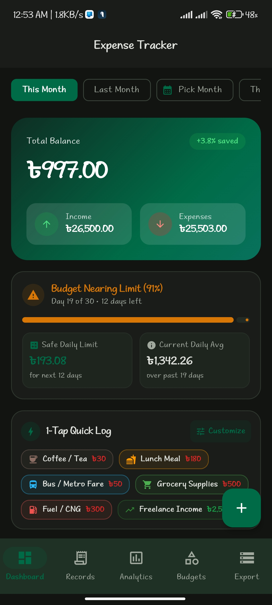
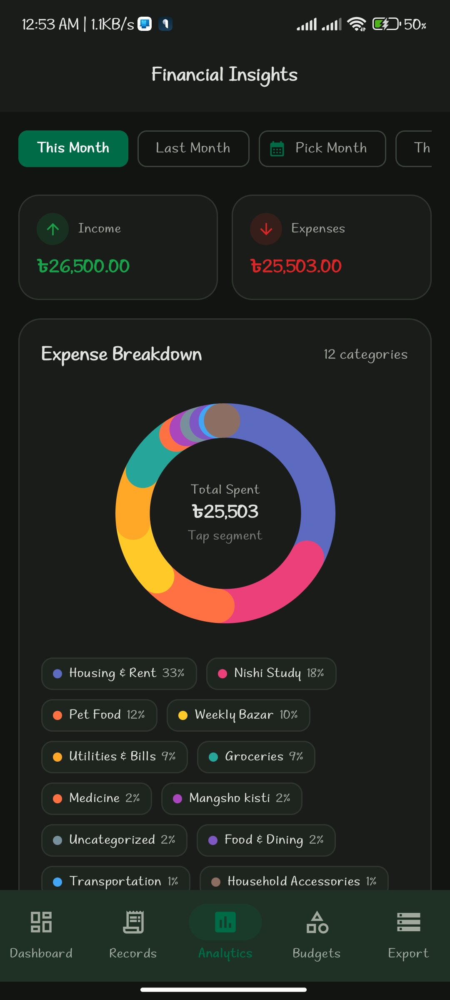
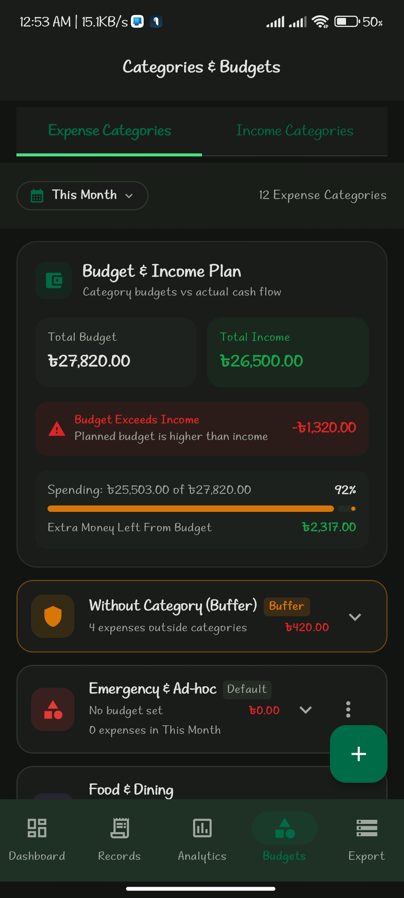
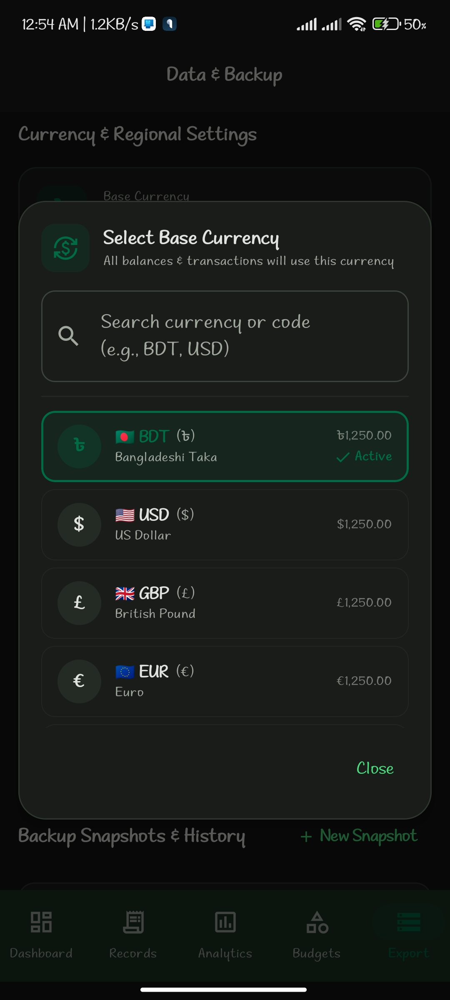
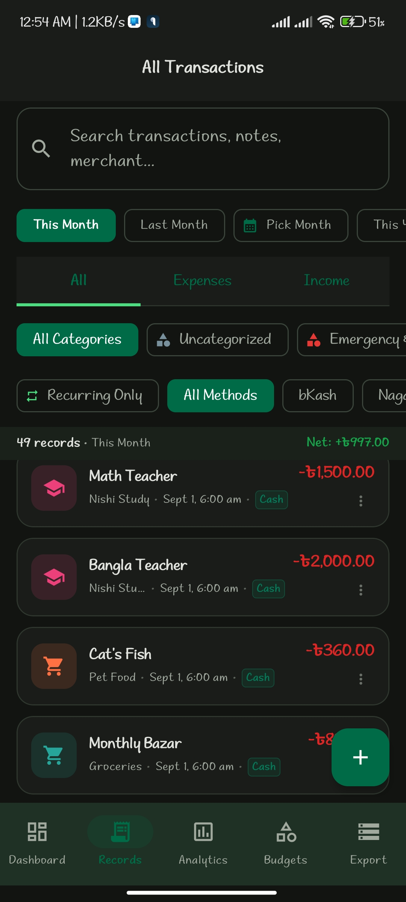
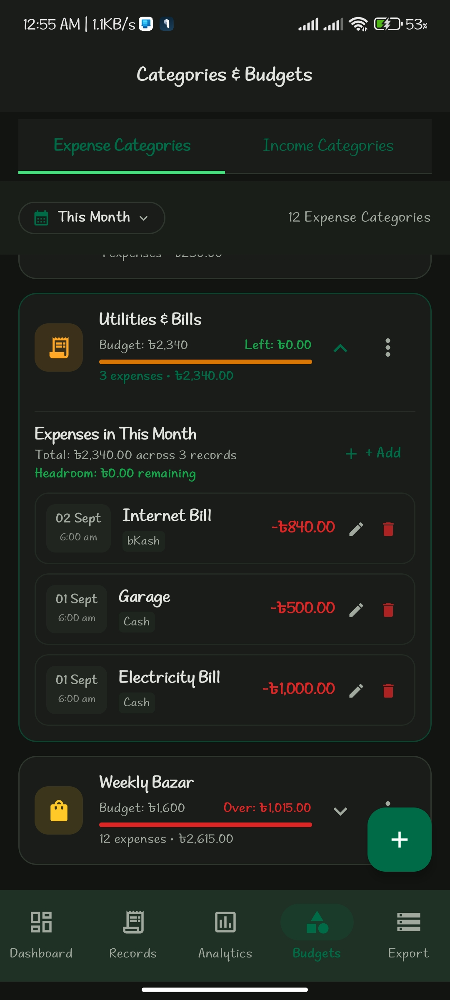

# Expense Tracker v1.1

A modern Android expense tracking app built with Kotlin and Jetpack Compose. Track income/expenses, manage categories with budgets, view analytics, and export your data.

## Features

- **Dashboard** - Overview of balance, income, expenses, and monthly trends
- **Transaction Management** - Add, edit, delete, search, and filter transactions
- **Analytics** - Visual charts for spending patterns and financial insights
- **Categories & Budgets** - Custom categories with budget limits and tracking
- **Quick Add** - 1-tap templates for frequent transactions
- **Export & Backup** - CSV/JSON export, manual snapshots, restore data
- **App Lock** - PIN-based app protection
- **Monthly Audit** - Expense audit reports
- **Multi-currency** - Configurable base currency
- **Recurring Transactions** - Support for recurring income/expenses

## Screenshots

<p align="center">
  
  
  
  
  
  
</p>

## Tech Stack

- **Language:** Kotlin
- **UI:** Jetpack Compose + Material 3
- **Database:** Room (SQLite)
- **Architecture:** MVVM
- **Async:** Kotlin Coroutines
- **DI:** ViewModel + Compose
- **Image Loading:** Coil
- **Networking:** Retrofit + Moshi + OkHttp
- **Testing:** JUnit, Robolectric, Roborazzi
- **Firebase:** App Check (reCAPTCHA)

## Project Structure

```
app/src/main/java/com/fahimshahrier/
|-- MainActivity.kt              # Entry point, navigation, dialogs
|-- data/
|   |-- local/
|   |   |-- AppDatabase.kt       # Room database
|   |   |-- dao/                  # Data Access Objects
|   |   +-- entity/               # Database entities
|   |-- model/
|   |   +-- QuickAddTemplate.kt   # Quick add data model
|   |-- repository/               # Data repository layer
|   +-- export/                   # CSV/JSON export logic
+-- ui/
    |-- components/               # Reusable UI components
    |-- screens/
    |   |-- DashboardScreen.kt
    |   |-- TransactionsScreen.kt
    |   |-- AnalyticsScreen.kt
    |   |-- CategoriesScreen.kt
    |   +-- ExportBackupScreen.kt
    |-- viewmodel/
    |   +-- FinanceViewModel.kt   # Main ViewModel
    +-- theme/                    # Material 3 theme
```

## Requirements

- Android 7.0 (API 24) or higher
- Target SDK: 36

## Build

```bash
# Debug build
./gradlew assembleDebug

# Release build (requires signing config)
./gradlew assembleRelease
```

## Configuration

Copy `.env.example` to `.env` and configure:

```env
# Add custom configuration variables here if needed
```

## Dependencies

| Category | Library |
|----------|---------|
| UI | Jetpack Compose, Material 3 |
| Database | Room 2.7.0 |
| Networking | Retrofit 2.12.0, OkHttp 4.10.0, Moshi |
| Image | Coil 2.7.0 |
| Coroutines | Kotlinx Coroutines 1.10.2 |
| Testing | JUnit, Robolectric 4.16.1, Roborazzi |

## License

Copyright (c) 2026 FahimShahrier. All rights reserved.
